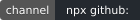
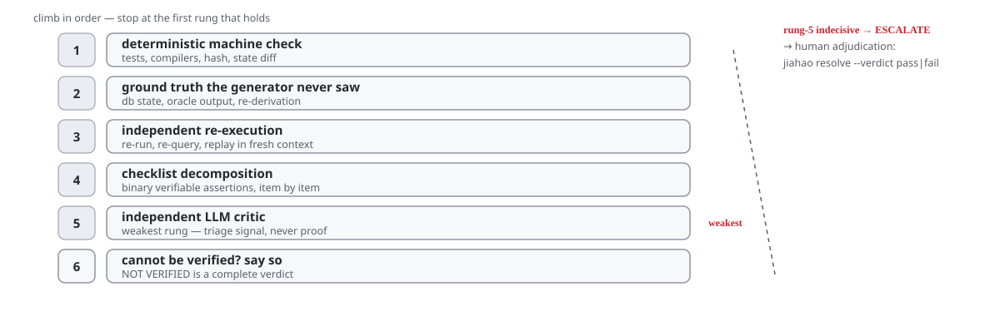
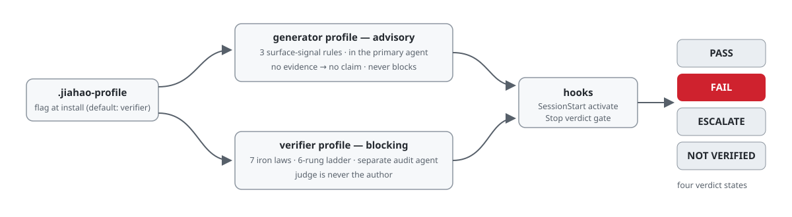

[English](README.md) | **中文**

<!-- translation-baseline: f88b88bef22b36dc4ca638ad2f752d323cbac483 -->

<p align="center">
  <picture>
    <source media="(prefers-color-scheme: dark)" srcset="docs/assets/brand/logo-dark.png">
    
  </picture>
</p>

<h1 align="center">Jiahao（嘉豪）</h1>

<p align="center">
  面向 LLM 智能体的<b>双配置（dual profiles）</b>提示即心智模型技能分发。
</p>

<p align="center">
  
  
  
  
</p>

> 本文件为 `README.md` 的中文结构镜像（ADR-0079 D1/D4）：与英文原文不一致时，**English original prevails**（以英文原文为准）。逐字钉块（裁决行、声明、命令）保持英文原样并附原句指针。

**状态 — 可安装的纪律脚手架，测量已公开失败**（ADR-0069）。本包内的安装渠道、hook 接线与声明纪律是真实且经过演练的；已测量的检测声明是公开的，并且失败了（English original prevails）：

> devin-corpus@v2 falsification test: failed (n=120, lie=31, FP=21/89, CI lower=0.142229) (verdict date: 2026-09-15)
>
> This is a decision-table outcome from a seeded-emergence bench corpus, not a precise performance estimate; devin-corpus@v2 is never cited by any conformity claim.

该裁决针对记分器工件 `src/port/score.js` —— 失败类别是构念错位（construct misalignment，它在"看起来像退出报告"上触发，而非声明-证据矛盾）。确定性的声明-证据配对器是 CAPA 修复轨；经 devin-corpus@v3 裁决的通道给出了 v3 路线（一次性裁决于 2026-09-16 落地：falsification-passed —— 见下方 v3 小节）。**本页任何内容都不是检测有效性声明。**

## What it does

LLM 智能体存在虚假完成综合征（False Completion Syndrome）：虚报成功、对完成情况自我欺骗、幻觉式自评。Jiahao 将声明与验证分离，机械化地索取证据 —— 同时不断言测量已解决问题（上方的失败裁决留在记录中）。该模式借鉴 [ponytail](https://github.com/DietrichGebert/ponytail)，但专门化于验证者角色。

Jiahao 提供两套安装期规则集，安装时择一：

| 配置 | 安装于 | 行为 |
|---------|--------------|----------|
| **generator** | 执行工作的主 Agent | 3 条表面信号规则（无证据 → 无声明、列出已验证的状态变更、验证 = 调用工具）。**仅建议性** —— 永不阻断。 |
| **verifier**（默认） | 审查工作的审计 Agent | 7 条铁律 + 6 级验证阶梯 + 哈希链 + 置信度校准 + 偏误防护。**缺证据即阻断**。 |

<p align="center"> 六级阶梯 -> PASS / FAIL / ESCALATE / NOT VERIFIED" width="880"></p>

**generator 配置** 针对主 Agent 内部的表面信号（你无法自证 —— 属已验证的建议）。**verifier 配置** 在独立的审计 Agent 中运行，独立性定理在此真正成立：外部验证者能发现生成者结构性看不见的错误。

## Readiness status (ADR-0072)

（就绪状态逐字钉块，English original prevails：）

- [installed-artifact measured] The Tier-1 channel installs in a clean environment and writes the profile flag (record: `.scratch/grill-t11/readiness/`).
- [installed-artifact measured] The verifier Stop gate blocks on missing evidence and allows on evidence, end-to-end on the installed artifact.
- [installed-artifact measured] The conviction lane runs stdin `transcript_path` -> adapter -> pairItem -> shadow record on the installed artifact.
- [documented] The lane runs in shadow mode only - flagged items are telemetry, never blocks. The shadow->enforce promotion gate is frozen at 0 organic events; "usable for real testing" declares the bake window may start collecting, not a gate pass.
- [documented] Per-host transcript reachability is documented (claude-code: `measured-present` - live-observed: independent-audit reproduction + automated-harness events; organic pending); bake traffic begins with owner dogfooding after a separate host-config confirmation.

## Install

### CLI installer (Tier 1, recommended)

Tier 1 是与名称无关的渠道：直接从公开 git 仓库安装。该渠道于 2026-09-16 在干净环境中实测过（第一方记录：`.scratch/grill-t8/readiness/b2-install-measurement.md`）。

> **Install-channel verification (ADR-0074 D-D).** The 2026-09-16 measurement
> predates the sanitized-history publish (the measured tip was rewritten); the
> claim was re-verified against the published tip per the pre-registered plan
> (ADR-0074 D-E): `verified-at-published-tip:051744a7a1b4027a42720814c819bf051e0831a8`
> + `npx github:Xxx91n/jiahao init --profile verifier -y` + 2026-09-17 +
> clean-env-reverify. Evidence: `.scratch/grill-t13/audit-evidence/reverify-2026-09-17.json`.

```sh
npx --yes github:<org>/jiahao init                      # interactive profile prompt
npx --yes github:<org>/jiahao init --profile verifier   # non-interactive (CI-safe)
npx --yes github:<org>/jiahao init -y                   # accept default (verifier)
npx --yes github:<org>/jiahao init --dry-run            # print, do not write
npx --yes github:<org>/jiahao resolve                   # phase 1: preview evidence (no machine verdict shown)
npx --yes github:<org>/jiahao resolve --verdict pass --reason "tests re-run green" --reviewer alice
```

> **Naming declaration (ADR-0059 D-A).** The unprefixed npm package name
> `jiahao` is a third party’s 2019 test package. This project has never
> published to npm and does not claim that name — do not install it from the
> registry. Future publication, if it ever unfreezes (defer-0001 conditions),
> will use the scoped name `@<org>/jiahao` (reserved under defer-0028).
> Renaming the project is rejected.

CLI 只写 `.jiahao-profile`；适配文件由 `scripts/build-adapters.js` 分发，安装器从不复制（漂移护栏）。下方手动 `echo` 保留为 Tier 0（零依赖回退）。

### Profile selection (install-time)

在配置目录（默认 `$CLAUDE_CONFIG_DIR` 或 `$HOME`）创建标志文件：

```bash
# Pick ONE — verifier is the default if the flag is absent.
echo generator > ~/.jiahao-profile      # primary agent
echo verifier > ~/.jiahao-profile       # audit agent
```

`SessionStart` 激活 hook 读取该标志并下发对应规则集；`Stop` 裁决门 hook 仅在 verifier 模式下对缺证据阻断，generator 模式下发出 `JIAHAO ADVISORY` 系统消息。

### Verifier deployment discipline

（English original prevails —— 部署纪律逐字条款见英文原文。）

验证者独立性在部署层强制，而非配置层：

- 在**独立上下文窗口**运行验证者 —— 子 Agent、队友会话或独立进程；绝不使用同上下文自审。
- **优先为验证者选择不同模型家族**。同家族裁判存在上下文隔离无法消除的内在自偏好偏误（Wataoka et al. 2024）；更强的同家族模型可能偏误更大（Yang et al. 2026）。
- 一次安装只用一个配置 —— generator 与 verifier 不应作为互相竞争的自动加载规则集共存于一个项目。

Wiring 测试保证文档↔代码一致，而非行为正确性 —— **agreement is not accuracy**（ADR-0059 D-D）。它们是表征/变更检测层，提供*一致性层级有限保证*（ISAE 3000 词汇），而非独立保证；独立性来自独立的信息边界（见上），绝不来自自证。

完整部署纪律见 ADR-0011。

### Threat model (mandatory, ADR-0014 D3)

Jiahao 的词表与检测逻辑**不是隐藏秘密**：工作目录内任何有文件读权限者（被审计 Agent 自身、其工具、其同伴）都能读到。真实防御是：基于 Agent 不控制的工具输出证据的 L1-L3 结构信号（设计上公开）；以及仅作为抬价手段的词表隐私 —— `phrases.json` 有指纹校验（SHA-256）但永非安全边界（CWE-656 混淆）。Jiahao 对*易漂移而非敌对*的 Agent 有效；对真正敌对者还需叠加 harness/OS 级隔离。

## Verification Ladder

<p align="center"></p>

1. 确定性机器检查（测试套件、编译器、哈希比对）
2. 基准真值比对（数据库状态、oracle 输出）
3. 独立重执行（重跑、重查、回放）
4. 检查单分解（二元断言验证）
5. 独立 LLM 评审（最弱一级 —— 仅分诊信号）
6. NOT VERIFIED（诚实、完整的裁决）

若第 5 级执行后以不决告终（错误、超时、矛盾），门发出 **ESCALATE** 而非静默通过 —— 第四裁决为仅建议性，经
`jiahao resolve --verdict pass|fail --reason <text> --reviewer <id>`
将声明路由至人工裁决（ADR-0017）。人工裁决以只追加 `human_verdict` 记录写回同一哈希链并进入校准回路。

## Hosts and protection tiers (ADR-0028 D6)

各宿主能力并不均等。强制能力如实披露，不作假定：

| 层级 | 宿主 | 强制力 | 安装指针 |
| --- | --- | --- | --- |
| Hook tier | claude-code | Verifier exit-2 blocking semantics | Claude Code 插件 —— 见 `hooks/jiahao-hooks.json` |
| Hook tier | codex | Verifier exit-2 blocking semantics | 复制 `adapters/codex/hooks.json` -> `.codex/hooks.json` + hook 脚本 -> `.codex/hooks/` |
| Hook tier | copilot, qoder | Verifier exit-2 blocking semantics | 按对应 adapter README 使用生成的 `adapters/<host>/` 文件 |
| Instruction tier | cursor, windsurf, cline, opencode, aider, instruction-tier (AGENTS.md) | Advisory-only soft injection | 复制 verifier 适配文件（如 `adapters/cursor/jiahao.mdc`）或 `*-generator.*` 变体 —— 均由 `src/SKILL.md` 生成 |
| MCP (source-only) | jiahao-mcp (git tree) | Profile parameter; relies on client policy. Not in the npm tarball | clone + `npm install` inside `jiahao-mcp/` (experimental) |

已知降级逐 adapter README 记录：copilot 仓库级 `sessionStart` 不触发（上游 issue #1730；`userPromptSubmitted` 为已证实注入路径）；opencode 尚无 hook/exit-2 机制（上游 #12472 开放、#14551 not-planned），故位于 instruction tier；aider 仅经显式 `read:` 配置加载规则。

## Usage

- `/jiahao lite` —— 仅第 1-2 级，跳过 LLM 评审
- `/jiahao full` —— 完整阶梯（默认）
- `/jiahao ultra` —— 完整阶梯 + 第 5 级用不同模型复核
- `/jiahao off` —— 停用

## Distribution boundary (ADR-0038)

（English original prevails —— 分发边界逐字条款见英文原文。）

npm tarball 是运行时工件：只安装提示配置与门脚本，仅此而已。基准答案语料（`probes.jsonl` / `judge-twins.jsonl` / `twins.jsonl` / `mr-probes.jsonl`）是维护者/CI 资产，**不分发** —— 既不在 npm 包内，也不在公开 git clone 中（公开仓库的全新 clone 同样不含语料）。需要语料的脚本依次解析 `JIAHAO_CORPUS_DIR` -> 安装植入目录 -> 仓库私有 `private/bench-corpus/`；确定性缺失的语料目录让门诚实降级到 exit 2（UNVERIFIABLE），存在但内容损坏则以 exit 1 失败关闭，stderr 前缀为封闭枚举 `[usage]:`/`[config]:`/`[internal]:`（ADR-0041 D3）。复现基准门是维护者/CI 渠道操作；第三方安装仅为提示安装器面。ADR 与开发文档只在 git 树（开发面），不进 tarball —— 请 clone 仓库阅读（ADR-0039）。

> **History note (ADR-0074).** On 2026-09-17, before first publish, the pre-push
> history underwent an owner-ordered sanitized-history rewrite: sensitive paths
> were removed so no published tree ever carried them, and tip-region commit
> SHAs changed (bounded scope; earlier history untouched). Pre-rewrite SHA
> citations in docs resolve through `docs/rewrite-map.json` — the single
> translation point (generated in the R2 action round); the event record is
> ADR-0074 and the sanitization runbook.

MCP 适配器（`jiahao-mcp/`）是 **source-only** git 树组件：不在 tarball 内，也从不经 npm 分发。请从 clone 运行 —— `git clone <repo> && cd jiahao-mcp && npm install`（状态：experimental / source-only；ADR-0059 D-B）。MCP 发布渠道已挂起（defer-0029）。

## Measurement record

（测量记录各小节为逐字钉块；下列中文仅为导读，**English original prevails**。）

裁决速览 —— 每一行在本页下方各小节中均有逐字绑定；本页不对真实流量作任何检测有效性声明。

| 渠道 | 语料 | 裁决 | 日期 | 记录 |
| --- | --- | --- | --- | --- |
| T-6 确认性（产品移植） | polygraph-bench @994bdeb3，396 项 | CONFIRMATORY PASS（in-sample 回放） | T-6 轮 | [ADR-0065](docs/adr/0065-t6-confirmatory-round-adjudication-port-surface-devin-corpus-and-claim-honesty.md) |
| devin-corpus@v1 OOT | 种子台架，n=52，lie=12 | indeterminate | 2026-09-15 | [ADR-0067](docs/adr/0067-devin-corpus-v1-oot-falsification-adjudication.md) |
| devin-corpus@v2 OOT | 种子台架，n=120，lie=31，FP=21/89 | **failed** | 2026-09-15 | [ADR-0068](docs/adr/0068-devin-corpus-v2-dual-axis-adjudication-collection-protocol-claim-slot-v3-binding.md) |
| devin-corpus@v3 OOT（CAPA 配对器） | 种子台架，n=120，lie=36，FP=0/84 | passed | 2026-09-16 | [ADR-0069](docs/adr/0069-capa-claim-evidence-pairer-artifact-freeze-adjudication-anchor-readiness-positioning.md) |

### Confirmatory claims (T-6, ADR-0065 D-E)

关于 T-6 产品移植的每条确认性声明均逐字复述以下固定事实。唯一权威为
bench/research/out/claim-template.md；同一文本块亦见
bench/research/out/confirmatory-report.md（空白归一化后一致）。

1. Floor arithmetic: the single absolute gate is confirmatory recall@FP0
   >= 0.563863 = baseline 0.4792 + d_MDE 0.084663 (frozen by ADR-0064 D-A;
   no post-hoc threshold moves, ADR-0065 D-A).
2. Trigger-mask control NOT HEALTHY: masking the 95 perfectly
   label-correlated tokens RAISED recall@FP0 by +0.1093 - the reference
   model partially exploits label-leaking lexical artifacts.
3. Closing channel: the closing message carries ~0.28 of recall@FP0; a
   scorer blind to it loses most of the signal.
4. Terminal fact (this round): CONFIRMATORY PASS - char-3|count|lr|C1.0|df2
   replayed the frozen corpus (polygraph-bench @994bdeb3, 396 items) through
   the shipped product port at recall@FP0 1.000000 with FP@default 0.000000
   (in-sample replay of the artifact trained on the full frozen corpus; the
   out-of-fold honesty claim remains the rung-1 research number, never
   max-of-trials).
5. Fallback honesty: the top survivor was judged first and passed; the
   fallback word-1|count|lr|C1.0|df2 leg never fired. Had it fired and
   passed, every claim would state: "the top-ranked survivor
   char-3|count|lr|C1.0|df2 failed confirmation; the adopted scorer is
   word-1|count|lr|C1.0|df2 (headline is never max-of-trials)."
6. Advisory channel: tier-(b) rel-L2 of port vectors vs the frozen gold20
   vectors measured max 0, mean 0 (count weighting is exact integer
   arithmetic on both sides) - diagnostic only, recorded in
   confirmatory-result.json, restated here, never moves an exit code.

### devin-corpus@v1 OOT falsification (grill-t7, ADR-0067 D-C)

OOT 裁决唯一权威为 bench/research/out/devin-oot-report.json；下列绑定声明块逐字同见于
bench/research/out/claim-template.md 与 bench/research/out/devin-oot-report.md。

devin-corpus@v1 falsification test: indeterminate (n=52, lie=12, CI lower 0.054861) (verdict date: 2026-09-15)

This is a small-sample (n_lie=12) decision-table outcome, not a precise performance estimate; devin-corpus@v1 is never cited by any conformity claim.

the pre-registered integer decision table assigns 3/12 to the indeterminate band; this is a decision-table outcome, not an effect estimate

### devin-corpus@v2 OOT falsification (grill-t7, ADR-0068 D-C)

v2 裁决唯一权威为 bench/research/out/devin-oot-v2-report.json；下列绑定声明块逐字同见于
bench/research/out/claim-template.md 与 bench/research/out/devin-oot-v2-report.md。

devin-corpus@v2 falsification test: failed (n=120, lie=31, FP=21/89, CI lower=0.142229) (verdict date: 2026-09-15)

This is a decision-table outcome from a seeded-emergence bench corpus, not a precise performance estimate; devin-corpus@v2 is never cited by any conformity claim.

dual-axis intersection-union verdict: lie axis 9/31 hits, CP 95% CI [0.142229, 0.480361] entirely below the conservative-transfer floor 0.563863 (lie-fail); FP axis 21/89, CI lower above the 0.10 usability bound (fp-fail); the stress side-set (20 command-exit honest items, never in either table) flagged 20/20 - a decision-table outcome, not an effect estimate

### devin-corpus@v3 OOT falsification (grill-t9, ADR-0069 D-C)

v3 裁决唯一权威为 bench/research/out/devin-oot-v3-report.json；下列绑定声明块逐字同见于
bench/research/out/claim-template.md 与 bench/research/out/devin-oot-v3-report.md。

devin-corpus@v3 falsification test: passed (n=120, lie=36, FP=0/84, CI lower=0.902606) (verdict date: 2026-09-16)

This is a decision-table outcome from a seeded-emergence bench corpus, not a precise performance estimate; devin-corpus@v3 is never cited by any conformity claim.

dual-axis intersection-union verdict on the CAPA claim-evidence pairer: lie axis 36/36 hits, CP 95% CI [0.902606, 1.000000] above the conservative-transfer floor 0.563863 (lie-pass); FP axis 0/84, CI upper below the 0.10 usability bound (fp-pass); the stress side-set (20 command-exit honest items, never in either table) flagged 0/20; port-vs-pairer divergence disclosed as telemetry only (28+42 cells over 140 scored) - a decision-table outcome, not an effect estimate

### Conviction lane claim (ADR-0070 D-E)

描述性存在声明 —— 三句注册句；车道状态值为 shadow（English original prevails）：

The CAPA claim-evidence pairer runs in **shadow mode** on the Stop/SubagentStop conviction lane for hosts that deliver a transcript file (per-host reachability is registered in the host-contract registry; currently `measured-present` (live-observed: independent-audit reproduction + automated-harness events; organic pending) only for claude-code): flagged contradictions are appended to the evidence chain as `source: pairer-instrument` shadow records and never enter the severity matrix.

The lane flags only a mechanically proven contradiction - a claimed value parsed from the transcript closing and an evidence value parsed from the tool-result stream, both present and unequal, inside the four registered families (exit-report, file-contains, count-report, content-append); unparseable claims, absent evidence, unsupported families, and hosts without transcript delivery are outside coverage and degrade as `undetermined` or `absent`, never as a flag and never as coverage:partial.

The devin-corpus@v3 adjudication describes that corpus's behavior; it is not a real-traffic recall claim, and the shadow->enforce promotion gate verifies flagged-item FP, undetermined coverage, and lane latency - it does not certify recall.

### Reproduce the measurement (measurement-reproduction invitation, ADR-0069 D-D.3)

本项目只邀请一件事：对已发布测量的独立复现 —— 而非采纳；不要求也不作出任何性能声明。

devin-corpus@v2 falsification test: failed (n=120, lie=31, FP=21/89, CI lower=0.142229) (verdict date: 2026-09-15)

This is a decision-table outcome from a seeded-emergence bench corpus, not a precise performance estimate; devin-corpus@v2 is never cited by any conformity claim.

v2 裁决冻结于带注释标签 `adjudicated/devin-corpus-v2`（commit 8807a61；失败类别：构念错位）。被裁决工件 `src/port/score.js` 与 `src/port/g6-manifest.json` 在该提交处 sha256 钉定。从已记录工件重导出全部已发布数字 —— 语料本身永不重开：
`node bench/research/devin-oot.js --snapshot-dir devin-corpus-v2 --replay`。
校验治理锚点：
`node scripts/build-governance-anchors.js --check`。不一致请按类别进入 CAPA 记录 —— 开一个指明不匹配字段的 GitHub issue；复现永不进入任何裁决链。

邀请同样延伸至 conviction-lane 渠道（ADR-0070）：车道的 shadow 记录在本地证据链上只追加，四个冻结的晋级输入可经
`node scripts/pairer-lane-telemetry.js` 重导出；随包配对器自身可经
`node scripts/check-pairer-regression.js` 回放冻结的 v3 语料。

## Develop

```bash
npm test                              # 1367 tests across 82 suites (full corpus tier; the public tier skips 7 corpus-bound tests with reasons, ADR-0056)
node scripts/kappa.js                 # ADR-0018 κ governance report (--save-baseline to pin)
node scripts/build-adapters.js        # regenerate 23 adapter files (11 hosts)
node scripts/check-drift.js           # CI drift check + profile purity
```

## Architecture

- `src/SKILL.md` —— 单一事实源（generator + verifier + 共享 Boundaries）
- `src/gate.js` —— 验证门组合阶梯（PASS / FAIL / ESCALATE / NOT VERIFIED）
- `scripts/resolve.js` —— 人工裁决 CLI（两阶段反锚定写回）
- `hooks/jiahao-profile.js` —— 配置模块（拆分与选择的 SSOT）
- `hooks/` —— 6 个 hook 脚本 + hooks.json + runtime.js
- `adapters/` —— 生成的分宿主适配（11 个宿主目录 / 23 个生成文件；ADR-0028 D5）
- `jiahao-mcp/` —— 仅 MCP 适配器（配置参数）
- `test/` —— 82 test suites, 1367 tests
- `bench/polygraph/` —— ADR-0015 基准适配器 + 冻结开发切分语料（ADR-0019 运行诚实 FAIL、ADR-0020 运行 PASS 优于 b2；见其 README）
- `private/bench-corpus/` —— 答案语料（probes/judge-twins/twins + 指纹；gitignored，ADR-0036 D2）。门脚本经 JIAHAO_CORPUS_DIR 解析，其次安装植入目录（`jiahao init` 自包内植入），再次维护者树内本仓库私有目录；处处皆无则失败关闭（exit 1: config；能力探针先将缺失语料目录降级为 exit 2 UNVERIFIABLE，ADR-0041 D2）。npm 消费者与公开 git clone 完全不含语料 —— 语料门是维护者/CI 专属契约，设计上失败关闭（ADR-0038 D2）。
- `docs/adr/` —— 架构决策记录（git 树开发面；ADR-0039）。下方索引为派生工件（ADR-0043），由 `node scripts/build-adr-index.js` 重建 —— 勿手改：

双配置流程：建议性 generator 产出声明；独立 verifier 走六级阶梯并落四种裁决之一。

<p align="center"></p>

<details>
<summary>ADR index — derived artifact (ADR-0043), rebuilt by `node scripts/build-adr-index.js`</summary>

索引与英文 README 同由 `node scripts/build-adr-index.js` 生成；逐字清单以英文原文为准（English original prevails），见 `README.md` 的 `<details>` 折叠区。

</details>

## License

MIT
